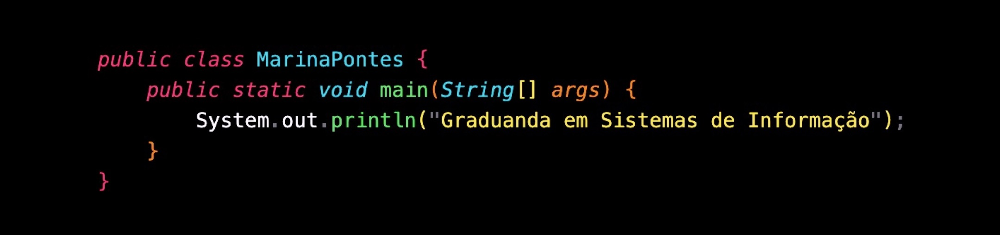
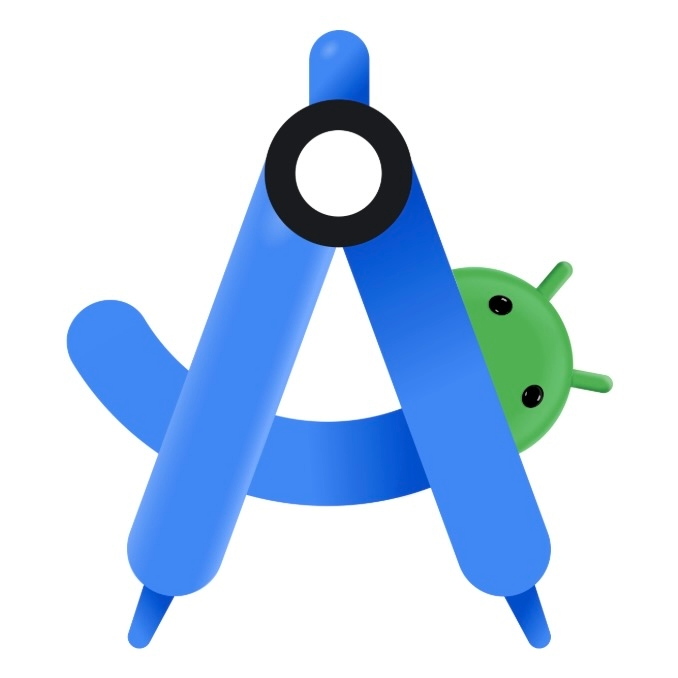
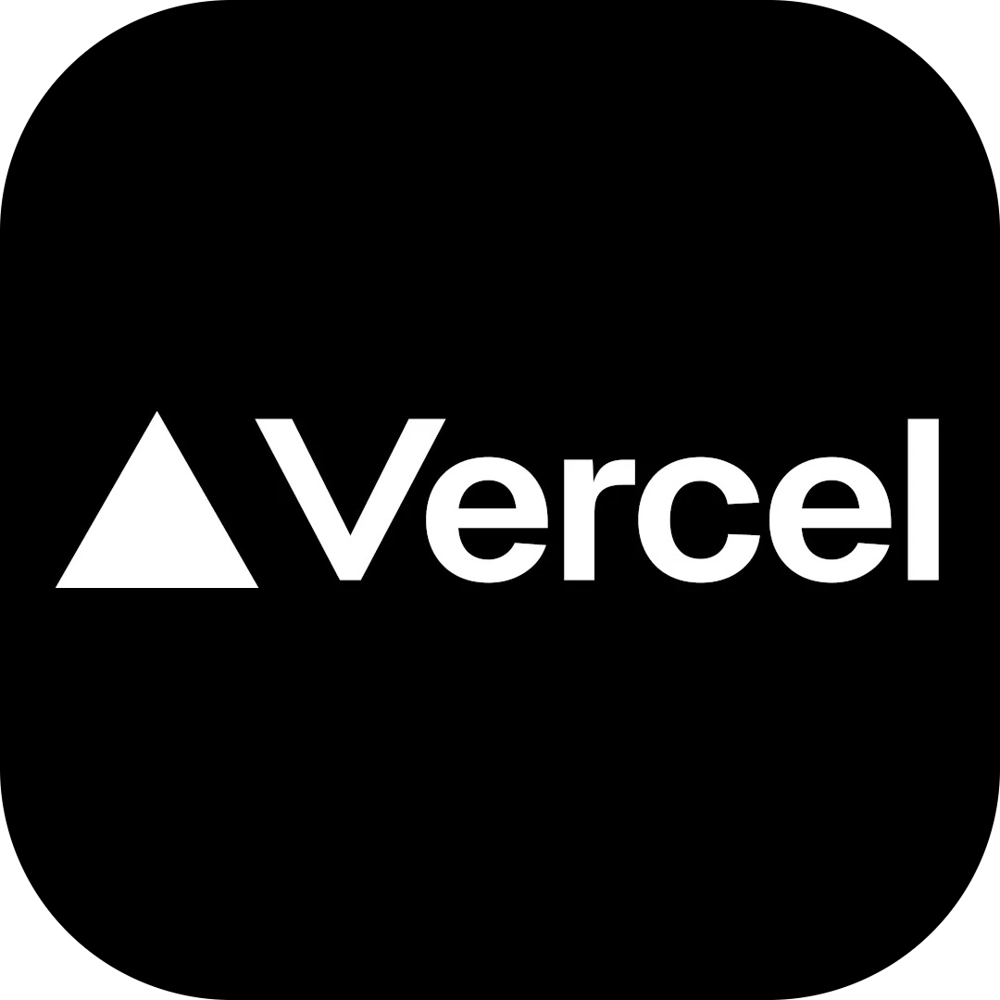

# Olá! Eu sou a Marina

### Minhas Habilidades

| Categoria | Tecnologias | |
| --- | --- | --- |
| **Linguagens** | HTML, CSS, JavaScript, Java |      |
| **Banco de Dados** | PostgreSQL | 
| **IDEs / Editores** | VS Code, Android Studio, IntelliJ IDEA |    |
| **Ferramentas** | Git, GitHub |   |
| **Deploy** | Vercel, Railway |   |

### Meus Projetos em Destaque

| Projeto | Descrição | Repositório |
| --- | --- | --- |
| **Sistema de loteamento** | Sistema para gestão de loteamento | [Link do Repositório](https://github.com/marinacpontes/sistemaimobiliaria) |
| **Perto de Mim** | App para encontrar prestadores de serviços perto de você | [Link do Repositório](https://github.com/marinacpontes/pertodemim) |

### Minhas Redes

| Rede | Link |
| --- | --- |
| **Linkedin** | [marinacpontes](https://linkedin.com/in/marinacpontes) |